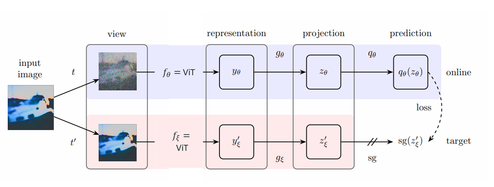
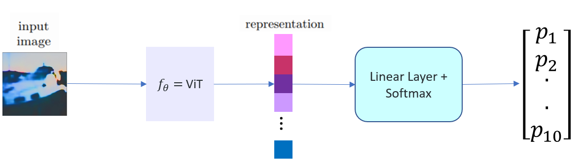
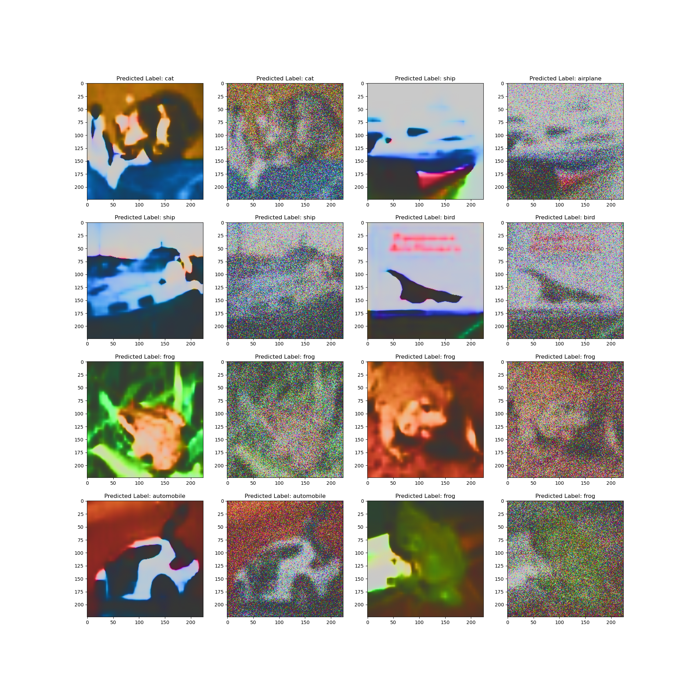
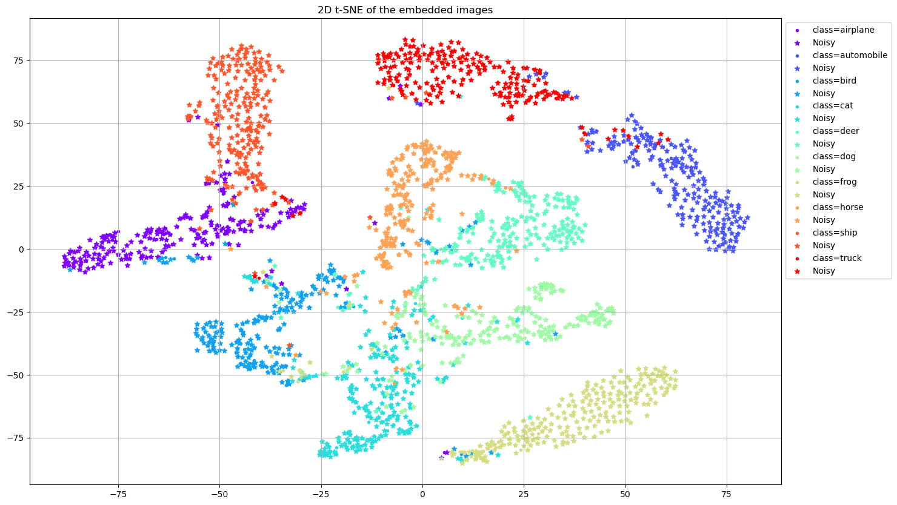
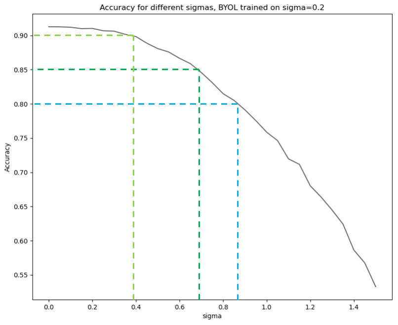
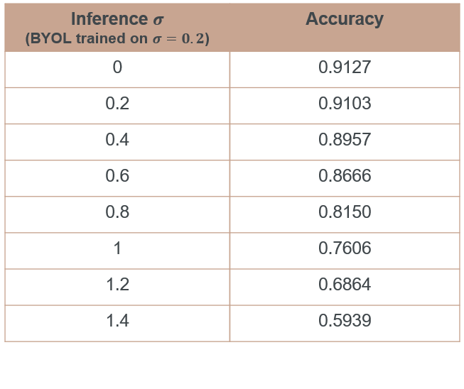

<h1 align="center">Vision Transformer + BYOL to improve classification of noisy images</h1>
<h2 align="center">Final project for the Technion's EE Deep Learning course (046211)
</h2> 

  <p align="center">
    Noa Shoham: <a href="https://www.linkedin.com/in/noa-shoham-9a80041b5/">LinkedIn</a> , <a href="https://github.com/noashoham">GitHub</a>
  <br>
    Shahar Yadin: <a href="https://www.linkedin.com/in/shahar-yadin-069725195/">LinkedIn</a> , <a href="https://github.com/shaharYadin">GitHub</a>
  </p>


## Background
The purpose of our project is training a classifier with robustness to noisy images.
We tackle the problem by the following method. First we train a BYOL, such that one of the augmentations is adding 
gaussian noise and the other is the identity. This way the BYOL learns a close representation for the clean image and its noisy version.
We chose the encoder model $\(f_\theta\)$ of the BYOL to be a Vision Transformer.
After the BYOL model is trained, we train a linear classifier on the representation of the clean images.
In inference, we show that although the classifier haven't seen noisy images, it performs well.

### An illustration for the whole system:
### ViT-byol model: 


### Classifier:


## Results
### Clean & noisy images with the classifier predictions

### t-SNE on the clean & noisy images' representation 

###  Accuracy for different sigmas (BYOL trained on sigma = 0.2)
<p float="left">
  
  
</p>


## Installation

Clone the repository and run
```
$ conda env create --name ViT-BYOL --file env.yml
$ conda activate ViT-BYOL
$ python main.py
```

## Config

Before running PyTorch ViT-BYOL, make sure you choose the correct running configurations on the config.yaml file.

```yaml
network:
  name: ViT
  pretrained: True
  # Specify a folder containing a pre-trained model to fine-tune. If training from scratch, pass None.
  checkpoints: 'checkpoints'
  use_amp: True

  projection_head:
    mlp_hidden_size: 512
    projection_size: 128

trainer: #byol trainer
  batch_size: 128
  m: 0.996 # momentum update
  checkpoint_interval: 5000
  max_epochs: 100
  num_workers: 6
  sigma: 1.4

classifier_trainer:
  batch_size: 1024
  m: 0.996 # momentum update
  checkpoint_interval: 5000
  max_epochs: 200
  num_workers: 6

mode: 'inference_for_different_sigmas' #optuna/train_byol/train_classifier/test_classifier/check_similarity_per_layer/inference_for_different_sigmas

optimizer:
  params: #byol_params 
    lr: 0.00001 #if pretrained = False use higher lr (0.0001)
    weight_decay: 0.0
  classifier_params:
    lr: 0.0003
    weight_decay: 0.0
```


## Files in the repository

| File name                                                     | Purpsoe                                                                                                                                       |
|---------------------------------------------------------------|-----------------------------------------------------------------------------------------------------------------------------------------------|
| `main.py`                                                     | general purpose main application                                                                                                              |
| `define_model.py`                                             | create the model and load relevant weigths                                                                                                    |
| `optuna_exp.py`                                               | main application for optuna examine parameters                                                                                                |
| `trainer.py`                                                  | main application for training BYOL-ViT or linear classifier model                                                                             |
| `classifier_inference.py`                                     | inference for BYOL representation and classifier accuracy (output at results/inference.txt)                                                   |
| `check_similarity_per_layer.py`                               | calculate the mean cosine similarity between noisy and clean images at each layer of BYOL. (output at results/cosine_similiarity_per_layer.png) |
| `utils.py`                                                    | save model training folder for each run                                                                                                       |
| `models/*.py`                                                 | BYOL and classifier models and their building blocks                                                                                          |
| `data/*.py`                                                   | transformations                                                                                                                               |
| `config/config.yaml`                                       | setup running configuration                                                                                                                |

## Running Example
### Training

* In the config file change `mode` to `train_byol` 
* run `python main.py`
* copy `byol_model.pth` from `\run\{chosen_run}\checkpoints` to `.\checkpoints`
* In the config file change `mode` to `train_classifier` 
* run `python main.py`
* copy `classifier_model.pth` from `\run\{chosen_run}\checkpoints` to `.\checkpoints`

### Inference & Visual Results
* In the config file change `mode` to `test_classifier/check_similarity_per_layer/inference_for_different_sigmas` 
* run `python main.py`


## TensorBoard

TensorBoard logs are written dynamically during the runs, and it possible to observe the training progress using the graphs. In order to open TensoBoard, navigate to the source directory of the project and in the terminal/cmd:

`tensorboard --logdir=./runs`

* make sure you have the correct environment activated (`conda activate env-name`) and that you have `tensorboard`, `tensorboardX` installed.
## Sources & References
### Sources
* The BYOL code was adapted from the following pytorch implementation of [PyTorch-BYOL](https://github.com/sthalles/PyTorch-BYOL).
* The ViT (Not pretrained) model code was adapted from the following implementation of [vision transformers CIFAR10](https://github.com/kentaroy47/vision-transformers-cifar10) 
### Refrences
* [Bootstrap Your Own Latent: A New Approach to Self-Supervised Learning](https://arxiv.org/abs/2006.07733). 
* [An Image is Worth 16x16 Words: Transformers for Image Recognition at Scale](https://arxiv.org/abs/2010.11929)
